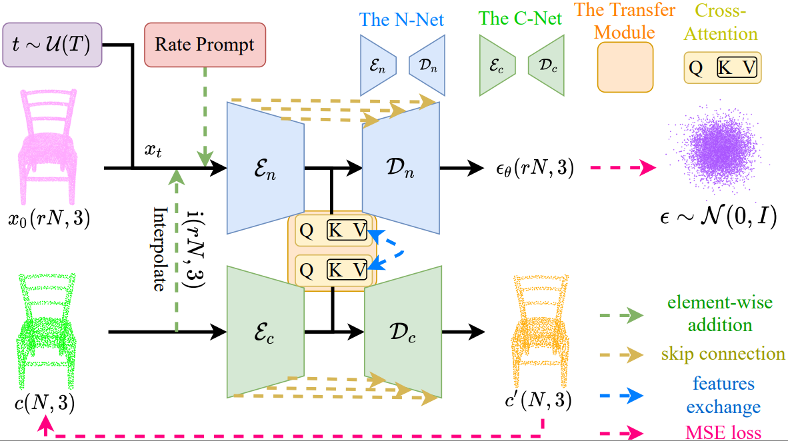

# PUDM

This repo is the official project repository of the paper **_A Conditional Denoising Diffusion Probabilistic Model for Point Cloud Upsampling_**. 
 - [ [paper](https://openaccess.thecvf.com/content/CVPR2024/papers/Qu_A_Conditional_Denoising_Diffusion_Probabilistic_Model_for_Point_Cloud_Upsampling_CVPR_2024_paper.pdf) ] [ [supp](https://openaccess.thecvf.com/content/CVPR2024/supplemental/Qu_A_Conditional_Denoising_CVPR_2024_supplemental.pdf) ]

## The Version Update for **_PUDM V2_**
We plan to release **_PUDM V2_** in the future.<br/>
This is expected to result in the following improvements compared to **_PUDM_**: <br/>
1. Point Number Decoupling. **_PUDM V2_** conducts upsampling based on the point number, not the upsampling rate. For example, the output (S, 3), S can be any positive integer. <br/>
2. Higher quality generation. This focuses more on the qualitative results (visualization) rather than the quantitative ones (CD or HD).

## The Overall Framework 
 

## Overview
- [Citation](#citation)
- [Installation](#installation)
- [Data Preparation](#data-preparation)
- [Model Zoo](#model-zoo)
- [Quick Start](#quick-start)


## Citation
If you find **_PUDM_** useful to your research, please cite our work as an acknowledgment.
```bib
@InProceedings{Qu_2024_CVPR,
    author    = {Qu, Wentao and Shao, Yuantian and Meng, Lingwu and Huang, Xiaoshui and Xiao, Liang},
    title     = {A Conditional Denoising Diffusion Probabilistic Model for Point Cloud Upsampling},
    booktitle = {Proceedings of the IEEE/CVF Conference on Computer Vision and Pattern Recognition (CVPR)},
    month     = {June},
    year      = {2024},
    pages     = {20786-20795}
}
```

## Installation

### Requirements
The following environment is recommended for running **_PUDM_** (an NVIDIA 3090 GPU):
- Ubuntu: 18.04 and above
- CUDA: 11.1 and above
- PyTorch: 1.9.1 and above
- python: 3.7 and above

### Environment

- Base environment
```
conda create -n pudm python=3.7 -y
conda activate pudm

conda install cudatoolkit
pip install nvidia-cudnn-cu11

pip install torch==1.9.1+cu111 torchvision==0.10.1+cu111 torchaudio==0.9.1 -f https://download.pytorch.org/whl/torch_stable.html

pip install open3d termcolor tqdm einops transforms3d==0.3.1
pip install msgpack-numpy lmdb h5py hydra-core==0.11.3 pytorch-lightning==0.7.1
pip install scikit-image black usort flake8 matplotlib jupyter imageio fvcore plotly opencv-python
pip install markdown==3.1.0

# For installing pytorch3d, please follow:
1. download pytorch3d-0.6.1-py37_cu111_pyt191.tar.bz2
   The official website: https://anaconda.org/pytorch3d/pytorch3d/files?page=10
   Our links: Baidu Netdisk and Google Drive in Model Zoom
2. conda install pytorch3d-0.6.1-py37_cu111_pyt191.tar.bz2

# compile C++ extension packages
cd PUDM-main
sh compile.sh
```

## Data Preparation
Please download [ [PU1K](https://github.com/guochengqian/PU-GCN) ] and [ [PUGAN](https://github.com/liruihui/PU-GAN) ]. 
```
# For generating test data, please see **PUDM-main/pointnet2/dataloder/prepare_dataset.py**
cd PUDM-main/pointnet2/dataloder

# For example 1, we can generate 4x test set of PUGAN:
python prepare_dataset.py --input_pts_num 2048 --R 4 --mesh_dir mesh_dir --save_dir save_dir

# For example 2, we can generate 4x test set of PUGAN with 0.1 Gaussion noise:
python prepare_dataset.py --input_pts_num 2048 --R 4 --noise_level 0.1 --noise_type gaussian --mesh_dir mesh_dir --save_dir save_dir
```

## Model Zoo
Please download our checkpoints: <br/>
[ [Baidu Netdisk](https://pan.baidu.com/s/1k9VgQ_VI_OzawrPxqwfQdw) ] (code : r2h9) or
[ [Google Drive](https://drive.google.com/drive/folders/1XIgLSpAPmt_Zjn9SSBF4EWSCyiHF6ByZ?usp=sharing) ] <br/>
Please put checkpoints in the **PUDM-main/pointnet2/pkls** folder. <br/>
**_*Released model weights are temporarily as the model structure of PUDM may be adjusted later._**

## Quick Start
### Example
We provide some examples. These examples are in the **PUDM-main/pointnet2/example** folder. The results are in the **PUDM-main/pointnet2/test/example** folder.
```bash
# For example 1 (4x), we can run 30 steps (DDIM) to generate 4x point cloud on KITTI with the pre-trained model of PUGAN.
# We provide the function (bin2xyz) of converting *.bin to *.xyz in **PUDM-main/pointnet2/dataloder/dataset_utils.py**.
cd PUDM-main/pointnet2
python example_samples.py --dataset PUGAN --R 4 --step 30 --example_file ./example/KITTI.xyz

# For example 2 (128x), we can run 30 steps (DDIM) to generate 128x point cloud for pig.xyz with the pre-trained model of PUGAN on an NVIDIA 3090 GPU.
cd PUDM-main/pointnet2
python example_samples.py --dataset PUGAN --R 128 --step 30 --example_file ./example/pig.xyz
```
This will produce the following result:
 
### Training
We provide two datasets to train PUDM, PUGAN and PU1K. The results are in the **PUDM-main/pointnet2/exp_{dataset}** folder.
```bash
# For training PUGAN
cd PUDM-main/pointnet2
python train.py --dataset PUGAN
```
```bash
# For training PU1K
cd PUDM-main/pointnet2
python train.py --dataset PU1K
```
### Errors that may occur during training
```
# If you encounter the errors: AttributeError: module 'distutils' has no attribute 'version'

# Traceback (most recent call last):
#  File "train.py", line 8, in <module>
#    from torch.utils.tensorboard import SummaryWriter
#  File "/dataa/anaconda3/envs/pudm/lib/python3.7/site-packages/torch/utils/tensorboard/__init__.py", line 4, in <module>
#    LooseVersion = distutils.version.LooseVersion
# AttributeError: module 'distutils' has no attribute 'version'

# Please follow the steps below to solve:
1. Open the __init__.py file: vim /dataa/anaconda3/envs/pudm/lib/python3.7/site-packages/torch/utils/tensorboard/__init__.py
2. Comment this statement: # LooseVersion = distutils.version.LooseVersion
3. Add this import: from distutils.version import LooseVersion
```
### Testing
We provide two datasets to test PUDM. The results are in the **PUDM-main/pointnet2/test/{dataset}** folder.
```
# For testing PUGAN
cd PUDM-main/pointnet2
python samples.py --dataset PUGAN --R 4 --step 30 --batch_size 27
```

```
# For testing PU1K
cd PUDM-main/pointnet2
python samples.py --dataset PU1K --R 4 --step 30 --batch_size 43
```

```
# For upsampling 128x on PUGAN (please note that the batch size is set to 1 on an NVIDIA 3090 GPU).
cd PUDM-main/pointnet2
python samples.py --dataset PUGAN --R 128 --step 30 --batch_size 1
```
